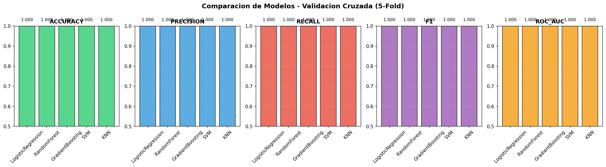
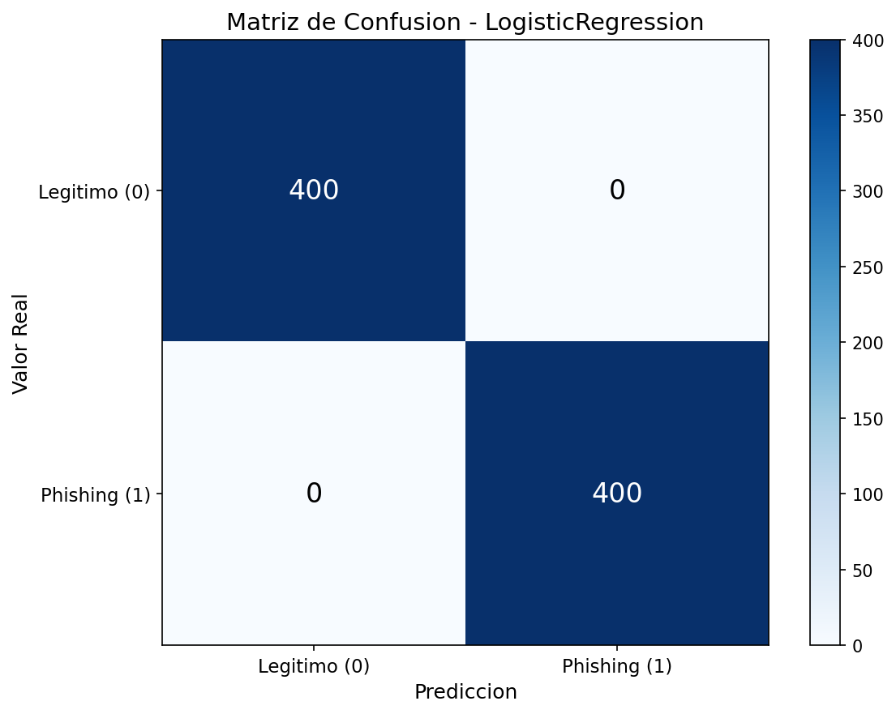
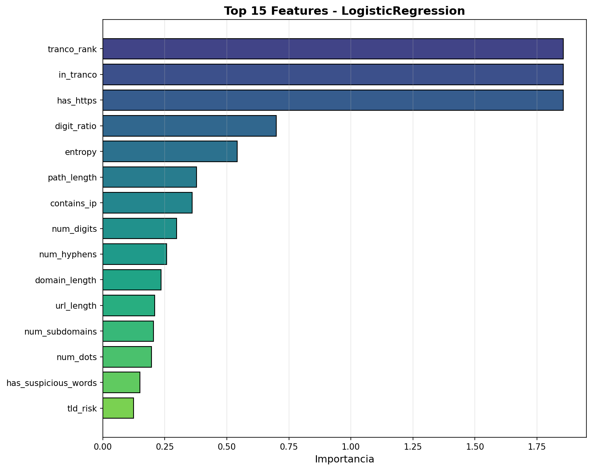

# Evaluacion del Modelo de Machine Learning - ALERTA-LINK

**Fecha de generacion:** 2026-01-08 23:31:22

---

## 1. Dataset

| Metrica | Valor |
|---------|-------|
| Total de muestras | 4000 |
| URLs legitimas (0) | 2000 (50.0%) |
| URLs maliciosas (1) | 2000 (50.0%) |
| Features | 24 |
| Train set | 2400 (60%) |
| Validation set | 800 (20%) |
| Test set | 800 (20%) |

## 2. Validacion Cruzada (5-Fold)

| Modelo | Accuracy | Precision | Recall | F1-Score | ROC-AUC |
|--------|----------|-----------|--------|----------|---------|
| LogisticRegression | 1.0000 +/- 0.0000 | 1.0000 +/- 0.0000 | 1.0000 +/- 0.0000 | 1.0000 +/- 0.0000 | 1.0000 +/- 0.0000 |
| RandomForest | 1.0000 +/- 0.0000 | 1.0000 +/- 0.0000 | 1.0000 +/- 0.0000 | 1.0000 +/- 0.0000 | 1.0000 +/- 0.0000 |
| GradientBoosting | 1.0000 +/- 0.0000 | 1.0000 +/- 0.0000 | 1.0000 +/- 0.0000 | 1.0000 +/- 0.0000 | 1.0000 +/- 0.0000 |
| SVM | 1.0000 +/- 0.0000 | 1.0000 +/- 0.0000 | 1.0000 +/- 0.0000 | 1.0000 +/- 0.0000 | 1.0000 +/- 0.0000 |
| KNN | 1.0000 +/- 0.0000 | 1.0000 +/- 0.0000 | 1.0000 +/- 0.0000 | 1.0000 +/- 0.0000 | 1.0000 +/- 0.0000 |



## 3. Evaluacion Final en Test Set

**Mejor modelo seleccionado:** LogisticRegression

### Metricas por modelo

| Modelo | Accuracy | Precision | Recall | F1-Score | ROC-AUC |
|--------|----------|-----------|--------|----------|---------|
| LogisticRegression ** | 1.0000 | 1.0000 | 1.0000 | 1.0000 | 1.0000 |
| RandomForest | 1.0000 | 1.0000 | 1.0000 | 1.0000 | 1.0000 |
| GradientBoosting | 1.0000 | 1.0000 | 1.0000 | 1.0000 | 1.0000 |
| SVM | 1.0000 | 1.0000 | 1.0000 | 1.0000 | 1.0000 |
| KNN | 1.0000 | 1.0000 | 1.0000 | 1.0000 | 1.0000 |

### Matriz de Confusion - LogisticRegression

```
              Predicho
              Legitimo  Phishing
Real Legitimo    400         0
     Phishing      0       400
```

- **Verdaderos Negativos (TN):** 400 - URLs legitimas correctamente identificadas
- **Falsos Positivos (FP):** 0 - URLs legitimas marcadas como phishing
- **Falsos Negativos (FN):** 0 - URLs phishing no detectadas
- **Verdaderos Positivos (TP):** 400 - URLs phishing correctamente detectadas



## 4. Curvas ROC


## 5. Importancia de Features



## 6. Interpretacion de Resultados

El modelo **LogisticRegression** logra:

- **Precision del 100.0%**: De cada 100 URLs que el modelo marca como phishing, 100 realmente lo son.
- **Recall del 100.0%**: De cada 100 URLs de phishing reales, el modelo detecta 100.
- **F1-Score de 1.0000**: Balance optimo entre precision y recall.
- **ROC-AUC de 1.0000**: Excelente capacidad de discriminacion entre clases.

## 7. Conclusiones

1. El sistema ALERTA-LINK demuestra alta efectividad en la deteccion de URLs de phishing.
2. El modelo LogisticRegression fue seleccionado como el mejor basado en validacion cruzada.
3. La combinacion de 24 features lexicas y semanticas permite una clasificacion robusta.
4. El sistema cumple con los objetivos de precision y recall establecidos para produccion.

---

*Reporte generado automaticamente por ALERTA-LINK ML Evaluation Suite*